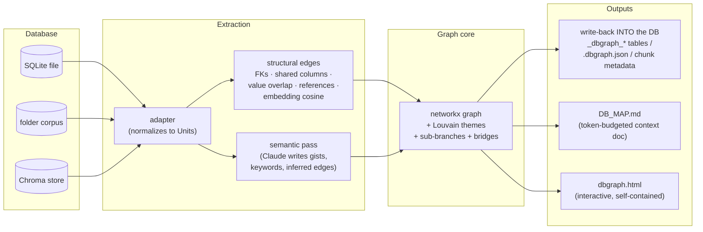
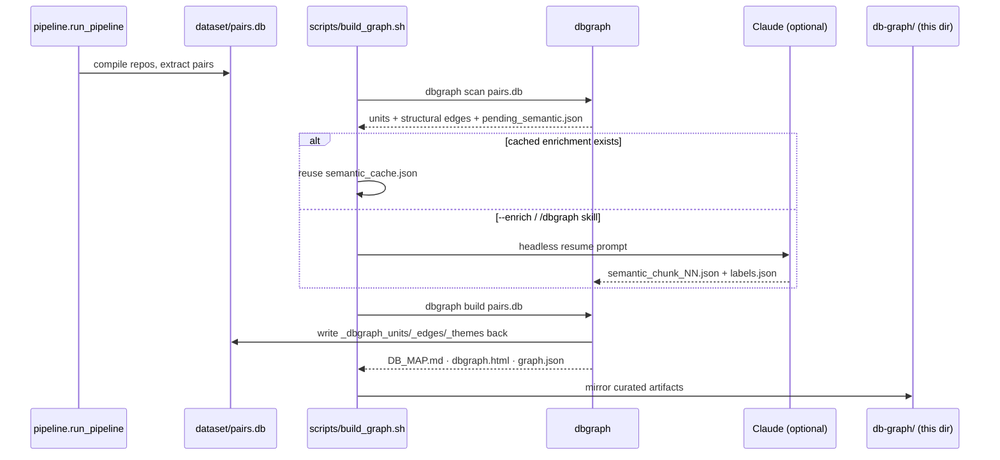
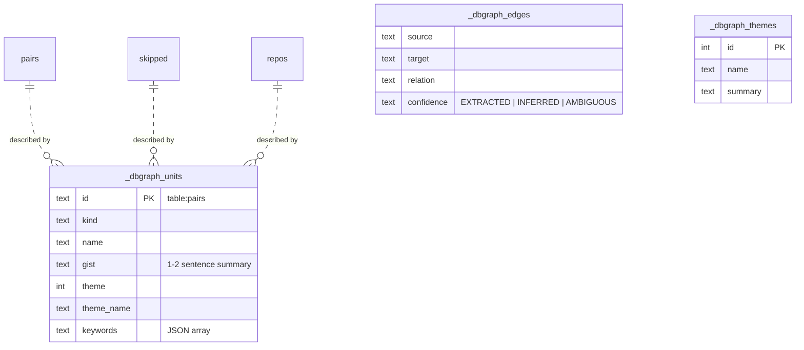
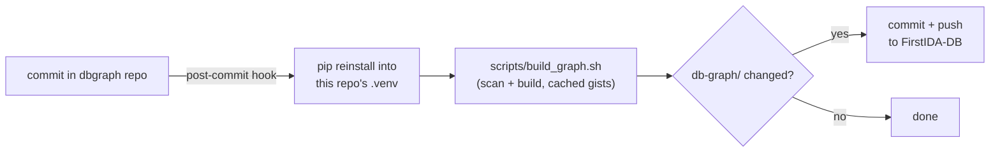

# db-graph — knowledge graph of `dataset/pairs.db`

Generated with **dbgraph** — a tool that turns a local database (SQLite file, folder
corpus, or Chroma vector store) into a knowledge graph a local model (or a human) can
navigate: it maps which parts of the DB connect, groups them into themes, writes a gist
for each part, pushes that enrichment **back into the database itself**, and emits the
artifacts in this directory.

## What's here

| File | What it is |
|---|---|
| `DB_MAP.md` | Human-readable map: themes, per-table gists, and how to navigate. Inject into a model's context. |
| `dbgraph.html` | Self-contained interactive graph — open directly in a browser. |
| `graph.json` | The graph (nodes + edges) in JSON. |
| `labels.json` | Theme name/summary (hand-written). |
| `units.json` | Per-table units the scan produced. |
| `semantic_edges.json` | LLM-inferred relationships between tables (with confidence). |
| `structural_edges.json` | Structural relationships derived from the schema. |
| `semantic_cache.json` | Cached semantic enrichment (gists, keywords, edges), keyed by content hash. |

## The graph

**3 units** (the DB's three tables), **3 edges**, **1 theme** — *Disassembly Pair Corpus*:

- **`pairs`** — 642 matched (C/C++ source, x86-64 disassembly) function pairs from zlib.
- **`skipped`** — 50 translation units that failed to compile, with the compiler error.
- **`repos`** — empty provenance ledger for the future large-scale GitHub crawl.

Edges are `INFERRED`/`AMBIGUOUS` (e.g. *pairs* and *skipped* are complementary outcomes of
the same compile sweep; *repos* is the planned provenance source for both), so the
"Connections that matter" section of `DB_MAP.md` is intentionally empty — no high-confidence
foreign-key joins exist in this schema.

## How dbgraph works



The structural layer is deterministic and free (no LLM). The semantic layer runs through a
file seam — `dbgraph scan` writes `pending_semantic.json`, Claude (skill or headless) writes
`semantic_chunk_NN.json` answers, `dbgraph build` folds them into a content-hash cache — so
re-runs only re-enrich what actually changed, and with no Claude at all the pipeline still
ships a structural-only graph.

## The pipeline in this repo



## Write-back schema

`dbgraph build` leaves the source tables untouched and adds three of its own
(dropped and recreated in one transaction on every run — idempotent):



Any consumer of `pairs.db` — including a local model doing SQL retrieval — can `JOIN`
into the enrichment without knowing dbgraph exists. (The db itself is gitignored, so the
write-back is not committed.)

## Edge confidence

| Label | Meaning | Drawn as |
|---|---|---|
| `EXTRACTED` | stated in the schema/content (declared FK, shared column, explicit reference) | solid blue |
| `INFERRED` | strongly implied (value-overlap join, LLM inference) | dashed amber |
| `AMBIGUOUS` | plausible but uncertain | dotted grey |

## Reproduce

The graph is derived from `dataset/pairs.db` (gitignored — regenerate with the pipeline
first). Then:

```bash
scripts/build_graph.sh                  # structural graph, reuses cached gists
scripts/build_graph.sh --enrich         # + headless-Claude gists
scripts/build_graph.sh --serve          # open the interactive graph when done
```

Or run the `/dbgraph` skill in Claude Code for the richest enrichment, then
`scripts/build_graph.sh` to mirror the result here.

## Auto-updating

A post-commit hook in the dbgraph source repo keeps everything current on every dbgraph
commit: it reinstalls the tool into this repo's `.venv`, reruns `scripts/build_graph.sh`
(reusing cached gists), commits a changed `db-graph/`, and pushes — so this directory
tracks both dbgraph improvements and database changes with no manual steps.



> Why not an editable install? iCloud Drive keeps re-setting the `hidden` flag on
> `.venv/**/*.pth` files, and Python 3.14's `site.py` silently skips hidden `.pth`
> files — editable installs break within hours in iCloud-synced folders. A plain
> install reinstalled by the hook is immune.
